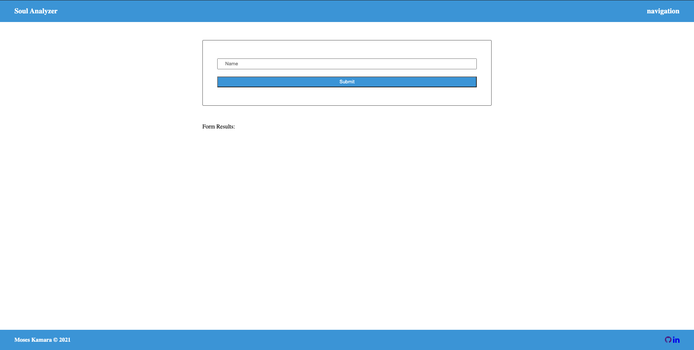
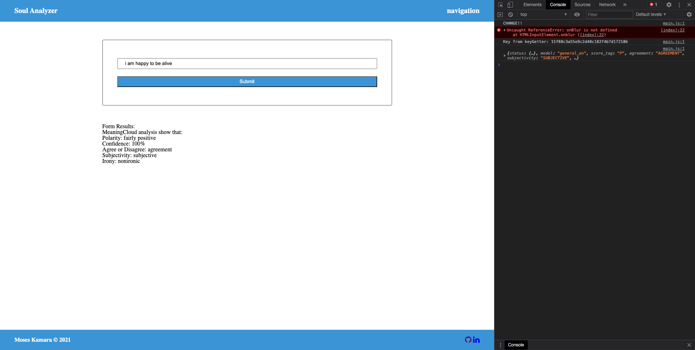
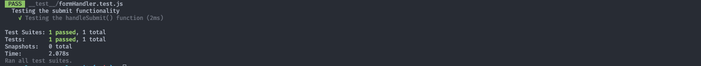

## Badges

## Description:
An applciation that uses MeaningCloud API to analyze a users input text or url in the inpurt form field. The API analyzes to see whether the text or url contains any sentiment.

## Technologies:
- Node.js
- Express
- Cors
- API (MeaningCloud)
- JavaScript
- Webpack
- Sass
- Babel
- Style-loaders

## Table of Contents
* [Description](#description)
* [Technologies](#topics)
* [Installation](#installation)
* [Usage](#usage)
* [Contributing](#contributing)
* [Test](#test)
* [Challenges](#challenges)
* [Questions](#questions)
* [License](#license)
* [Author](#Author)
* [Badges](#badges)

## Installation
Before installing this application on your local computer, ensure that you have Node installed. This application works in Node. You can go to the following website to download Node: <a href='https://nodejs.org/en/'>Node</a>

    1. Clone the Git repository
        $ git clone <repo>
    2. Navigate to the directory and install the dependencies
        $ npm init to create package.json package
        $ npm install express cors
    3. Run webpack.prod.js by typing run build-prod to build a dist folder for production.
    4. To run webpack-dev-server, type npm run build-dev in terminal. 
    5. Once the dev-server is runnning type npm run start to start the server in the terminal.

## Usage
Once all dependencies have been installed - run node server.js to launch the application. Go to localhost + the port number.

## Contributors
This application is open to anyone who wants to contribute or enhance the application. If you would like to contribute please reach out to me on Github or email.

## Test
Test are run using jest. I tested the handlesubmit function and the test passed as you can see below.

## Challenges
At first making the api calls to the meaningcloud API were difficult trying to figure out where to place the function to make the calls. 

## Questions
If you have questions about this repository? Please contact me at [kamara.moses@yahoo.com](mailto:kamara.moses@yahoo.com). View more of my work in GitHub at [kamara-moses](https://github.com/kamara-moses).

## License
This repository is licensed under the MIT license.

Copyright (c) [2020] [Moses Kamara]

Permission is hereby granted, free of charge, to any person obtaining a copy of this software and associated documentation files (the 'Software'), to deal in the Software without restriction, including without limitation the rights to use, copy, modify, merge, publish, distribute, sublicense, and/or sell copies of the Software, and to permit persons to whom the Software is furnished to do so, subject to the following conditions:

The above copyright notice and this permission notice shall be included in all copies or substantial portions of the Software.

THE SOFTWARE IS PROVIDED 'AS IS', WITHOUT WARRANTY OF ANY KIND, EXPRESS OR IMPLIED, INCLUDING BUT NOT LIMITED TO THE WARRANTIES OF MERCHANTABILITY, FITNESS FOR A PARTICULAR PURPOSE AND NONINFRINGEMENT. IN NO EVENT SHALL THE AUTHORS OR COPYRIGHT HOLDERS BE LIABLE FOR ANY CLAIM, DAMAGES OR OTHER LIABILITY, WHETHER IN AN ACTION OF CONTRACT, TORT OR OTHERWISE, ARISING FROM, OUT OF OR IN CONNECTION WITH THE SOFTWARE OR THE USE OR OTHER DEALINGS IN THE SOFTWARE.

## Author 
